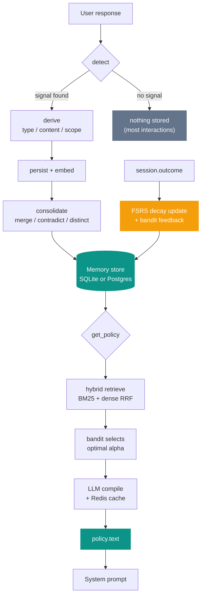

# imprint

**Behavioral memory for AI agents.**

Detect, distill, compile. Most memory systems store what was said -- imprint
learns what to do differently.

[](https://pypi.org/project/imprint-mem/)
[](https://pypi.org/project/imprint-server/)
[](https://github.com/rkv0id/imprint/blob/main/LICENSE)
[](https://pypi.org/project/imprint-mem/)

---

## What is imprint?

It watches agent-user interactions, extracts typed behavioral memories (rules,
preferences, facts, decisions), consolidates them as new ones arrive, and compiles
a behavioral policy the agent injects into its system prompt. The policy is the
output -- not a database the agent queries.



## The learning loop

What makes imprint different is the **online learning** path shown in amber above.
Every time a session closes with an outcome signal, two things happen:

1. **FSRS decay update** -- memories that were recalled get a stability boost;
   those that weren't gradually decay toward pruning
2. **Bandit feedback** -- the `BanditAlphaTuner` learns whether sparse BM25 or
   dense vector retrieval produced better outcomes for this agent, and adjusts
   the retrieval blend accordingly

Over time, the retrieval quality improves without any explicit configuration.
Frequently recalled memories that lead to positive outcomes persist and become
easier to retrieve. Irrelevant or incorrect memories decay and are pruned by
consolidation.

## Two packages

=== "imprint-mem"

    The core library. Embed directly in your agent process.

    ```sh
    pip install imprint-mem
    ```

    ```python
    from imprint import Imprint

    imprint = Imprint(
        agent_id="assistant",
        model="anthropic:claude-haiku-4-5-20251001",
        processing_mode="balanced",   # frugal | balanced | eager
    )
    await imprint.connect()

    # Record each agent turn -- nothing stored if no signal detected
    await imprint.observe(
        user_id="alice",
        agent_output="Here is a bullet list.",
        user_response="Please use prose instead.",
    )

    # Compile a behavioral policy -- inject into system prompt
    policy = await imprint.get_policy(user_id="alice")
    print(policy.text)
    # -> "Write responses in prose rather than bullet points."
    ```

    [Get started](getting-started/quickstart.md){ .md-button .md-button--primary }
    [API reference](library/api.md){ .md-button }

=== "imprint-server"

    The networked service. REST API + MCP SSE.

    ```sh
    pip install imprint-server
    imprint-server serve
    ```

    ```python
    from imprint.client import ImprintClient

    async with ImprintClient("http://localhost:8000") as client:
        policy = await client.get_policy("my-agent", "alice")
        await client.observe("my-agent", "alice",
            agent_output="Here is a list.",
            user_response="Prose please.")
    ```

    [Server docs](server/overview.md){ .md-button .md-button--primary }
    [REST API](server/rest-api.md){ .md-button }

## Key features

<div class="grid cards" markdown>

-   **Three processing modes**

    `frugal` uses pattern heuristics only -- zero LLM cost for observation.
    `balanced` adds LLM fallback for ambiguous signals. `eager` always runs
    the LLM for maximum recall. Pick per agent.

-   **FSRS-inspired memory decay**

    Memories have stability scores that increase on recall and decay over time.
    Consolidation prunes low-stability memories automatically. `FSRSGradientDecay`
    (via `imprint-mem[online]`) learns per-agent decay parameters from feedback.

-   **Contextual bandit retrieval**

    `BanditAlphaTuner` learns the optimal blend between BM25 keyword search and
    dense vector search from session outcomes. No manual tuning required.

-   **Hybrid BM25 + dense retrieval**

    FTS5 full-text search fused with pgvector or sqlite-vec via Reciprocal Rank
    Fusion. Falls back to list order without an embedder.

-   **MCP native**

    Mount imprint as an MCP SSE server. Eight tools: begin session, get policy,
    observe, recall, direct, end session, correct, reinforce. Claude Code,
    Cursor, Continue supported.

-   **Production ready**

    Postgres + pgvector, Redis distributed cache, rate limiting, versioned schema
    migrations with checksum verification, Prometheus metrics, Docker image.

</div>

## License

[Apache 2.0](https://github.com/rkv0id/imprint/blob/main/LICENSE).
