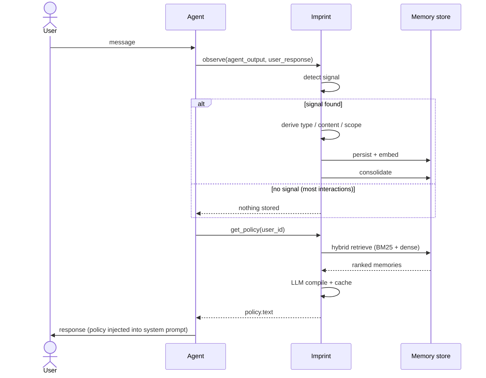

# Concepts

## The observe-compile loop

Imprint sits between the agent and the user. On every agent turn, `observe()`
runs. Before every agent response, `get_policy()` runs. Nothing changes in
how you write the agent -- the memory loop wraps the existing cycle.



## Memory types

Every stored memory has a type that influences how it is ranked during policy
compilation and how it behaves under consolidation.

| Type | What it captures | Example |
|---|---|---|
| `RULE` | Explicit behavioral constraint the agent must follow | "Write in prose, not bullet points." |
| `PREFERENCE` | User style or tone preference | "Alice prefers concise answers under 200 words." |
| `FACT` | Factual information about the user or context | "Bob works in the Pacific timezone." |
| `DECISION` | An agreed decision that should persist across sessions | "The team agreed to use async/await throughout." |
| `CONTEXT` | Situational context relevant to future responses | "Current project uses Python 3.12 and uv." |

The type is selected by the LLM during derivation (or inferred from heuristics
in frugal mode). `RULE` memories carry the highest weight in policy compilation;
`CONTEXT` memories are ranked by recency and scope relevance.

## Detection

Detection decides whether an agent-user exchange carries a learnable signal.
The vast majority of interactions are pure dialogue -- no preference, no
correction, no directive -- and observation produces nothing.

**Heuristic detection** runs first (always). Patterns like "don't do X",
"always Y", explicit preference language, corrections, and confirmations fire
without any LLM call.

**LLM detection** runs as fallback in `balanced` mode when heuristics are
silent. In `eager` mode it always runs regardless of heuristic results.

Detection is the primary cost lever:

| Mode | LLM calls per observe() |
|---|---|
| `frugal` | 0 (heuristics only) |
| `balanced` | 0 or 1 (LLM only when heuristics are silent) |
| `eager` | 1 (always) |

## Derivation

When detection finds a signal, derivation converts it into a memory:

1. **Type** -- what kind of memory (RULE, PREFERENCE, FACT, etc.)
2. **Content** -- canonical third-person phrasing ("The user prefers...")
3. **Scope** -- which context this memory applies to (see [Scopes](#scopes))

Derivation always calls the LLM in balanced and eager modes. In frugal mode,
a simplified heuristic derivation runs without LLM.

## Consolidation

New memories are compared against existing ones. One of four actions is taken:

| Action | When | Effect |
|---|---|---|
| `distinct` | Memories are unrelated | Both stay active |
| `merge` | New memory is redundant with existing | New memory discarded |
| `contradict` | New memory contradicts existing | Old deactivated, new stored |
| `scope_override` | Conflict is scope-specific | Both active, scope wins at compile time |

Deactivated memories stay in the store for lineage tracking. They never appear
in policy compilation.

## Scopes

Scopes partition memories by context. A memory tagged with `"project:alpha"`
only appears in policies requested with that scope. The `"global"` scope is
always included.

Declare candidate scopes on construction:

```python
imprint = Imprint(
    agent_id="reviewer",
    scopes=["project:alpha", "project:beta", "role:senior"],
)
```

With `dynamic_scopes=True`, imprint can create new scope names on the fly
during derivation. Near-duplicates are collapsed to existing names.

## Memory decay and stability

Every memory has a **stability** score between 0 and 1. Stability starts at 1.0
when a memory is created and decays over time using an FSRS-inspired formula.
On recall (when the memory appears in a compiled policy), stability increases.
On consolidation, memories below `prune_threshold` are deactivated.

```python
# Prune memories with effective stability below 0.3
pruned = await imprint.consolidate("alice", prune_threshold=0.3)
```

Stability decay rate: approximately 5% per week without recall, calibrated so
that a memory recalled once per week stabilizes at around 80%. Pinned memories
are never pruned regardless of stability.

With `imprint-mem[online]`, `FSRSGradientDecay` replaces the static formula.
It uses a [River](https://riverml.xyz/) online linear regressor to learn
per-agent decay parameters from session outcomes -- agents that retrieve certain
memories consistently in high-outcome sessions will see those memories decay
slower over time.

## The retrieval bandit

`BanditAlphaTuner` controls the hybrid retrieval blend:

```
alpha = 0.0  →  pure BM25 (exact keyword match)
alpha = 1.0  →  pure dense vector (semantic similarity)
0 < alpha < 1  →  weighted RRF fusion of both
```

After each session closes with an outcome signal, the bandit observes whether
the retrieved memories were useful and updates its alpha estimate using Thompson
Sampling. Over time it converges to the alpha that produces the best retrieval
quality for the agent's specific patterns.

The current estimate is exposed as a Prometheus gauge when extended metrics are
enabled:

```
imprint_bandit_alpha_estimate{agent_id="my-agent"} 0.67
```

A high alpha (close to 1.0) means semantic search is dominant for that agent.
A low alpha means keyword matching is more reliable. This varies by use case --
code review agents tend toward lower alpha (exact symbol matching matters) while
general assistants tend toward higher alpha.

## Policy compilation

`get_policy()` assembles the behavioral policy:

1. **Scope inference** -- if `scopes=` is not provided, infer from `context=`
2. **Retrieval** -- list active memories for the requested scopes
3. **Hybrid ranking** -- BM25 + dense vector search fused via RRF (if embedder configured), otherwise list order
4. **Token budget** -- truncate to `max_input_tokens`, always keeping pinned memories
5. **LLM compile** -- compile selected memories into a concise instruction block
6. **Cache** -- cache the result; invalidate when memories change

In frugal mode, step 5 is skipped for empty memory lists (returns an empty string).
The policy text is designed to be injected directly into the system prompt.

## Memory loops

A `MemoryLoop` tracks one agent turn end-to-end and carries the outcome signal
back to the learning system. Outcome signals update the bandit alpha tuner and
the decay model.

```python
loop = await imprint.open_loop(user_id="alice", context="code review")
policy = await imprint.get_policy(user_id="alice", loop=loop)

# ... agent generates response ...

loop.set_outcome(0.9)  # 0 = correction, 0.5 = neutral, 1 = ideal
await imprint.finalize_loop(loop)
```

See the [Online learning guide](../guides/online-learning.md) for how outcomes
drive adaptation.

## Storage

| Backend | When to use |
|---|---|
| `SQLiteMemoryStore` (default) | Single-process, local dev, embedded |
| `PostgresMemoryStore` | Multi-instance server, production |

For dense retrieval:

| Backend | When to use |
|---|---|
| `SQLiteVecStore` | Single-process, local dev |
| `PostgresVectorStore` | Multi-instance, pgvector |

Storage is configured either via constructor arguments or via environment
variables (`IMPRINT_STORE`, `IMPRINT_VECTOR_STORE`).
